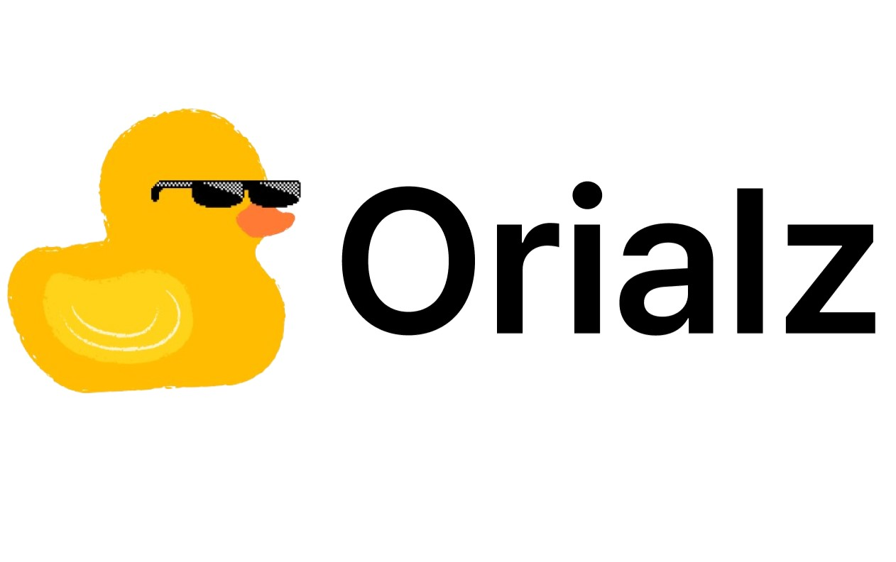
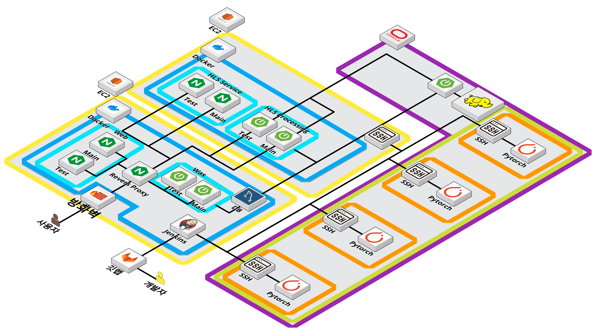

# 👀 오리알즈 블러 서비스

<h4 align="center">사용자 맞춤형 블러 영상 스트리밍 서비스 </h4>

<h5 align="center">개발기간: 2023.8.28 ~ 2023.10.06</h5>

팀 명 : 낙동강 오리들

프로젝트 명 : Orialz Blur Service

팀원 : 송진현, 이우석, 양을필 , 이지원 , 황시은

배포 링크 : [오리알즈 블러 서비스](https://test.orialz.com/)

<strong>내가 보고 싶은 것 만 보자! </strong>

# ❤ 서비스 소개

사용자가 원치 않는 객체를 지정해 해당 객체가 영상에 나올때 <strong>모자이크</strong> 처리 해주는 <strong>사용자 맞춤형 블러 스트리밍 서비스</strong> 

# 🧡 팀원 소개

|                  송진현                   |                       이우석                        |               양을필                |                    이지원                    |   황시은   | 
| :---------------------------------------: | :-------------------------------------------------: | :---------------------------------: | :------------------------------------------: | :--------: | 
| 
팀장
 
인프라,하둡
 | 
사물 인식 인공지능
 | 
프론트엔드
 
영상 Blur 처리 
 | 
백엔드

 로그인 + Rest API 
 | 
백엔드

 파일 분할 업로드 + Rest API
 |

 

# 💛 기술 스택

### Backend

 
  
  
  

### Database

  

### Frontend

  
  
  

### CI/CD & infra

  
  
  
  
    

### AI

  
  
  

### Collaboration

  
   
    

# 💚 코드 컨벤션 & Git flow

## 1. 코드 컨벤션

### 메소드명

- 예외를 반환하는 경우 끝에 OrElseThrow 붙임
  ex) 사용자 명을 찾는데 없으면 예외를 반환하는 경우 findMemberOrElseThrow 라고 붙임
- cancle같이 예외 반환이 명확한 경우엔 생략해도 괜춘

### 변수명

- final or static 이 붙는 변수명은 `대문자`로 작성, 공백이 필요하면 `_` 사용
- 그 외엔 `Camel Case` 사용

### ENUM

- 모든 항목은 `대문자`로 구성
- 각 원소 식별자는 정수가 아닌 `**문자열**`로 한다.

### 패키지 구성

- domain과 repository는 같은 패키지에 넣자

 

## 2. 브랜치 관리

## 1. 브랜치 관리
Git-Flow 브랜치 전략에 따라 기능별로 브랜치를 나누어 작업하고 있고 모든 브랜치에 대해 pull request를 통한 리뷰 완료 후 Merge를 하고 있습니다.

✅ master : 제품으로 출시될 수 있는 브랜치

✅ develop : 다음 출시 버전을 개발하는 브랜치. feature에서 리뷰완료한 브랜치를 Merge

✅ feature : 기능을 개발하는 브랜치

✅ hotfix : 출시 버전에서 발생한 버그를 수정하는 브랜치

참고 문헌
- [우아한 형제들 기술블로그 "우린 Git-flow를 사용하고 있어요"](https://woowabros.github.io/experience/2017/10/30/baemin-mobile-git-branch-strategy.html)
- [README 참고](https://github.com/f-lab-edu/event-recommender-festa)

## 2. 커밋 관리

Karma - Git Commit Msg

- 기능 하나당 하나의 브랜치에 작업
- 즉, `한 사람당 한 브랜치`를 사용
- 상황에 따라 `중간 브랜치`를 두고 그곳에 병합할 수 있음
- **브랜치 네이밍**은 `케밥 케이스` 사용
  ex) 방송의 채팅 피쳐를 맡은 경우 feature-live-chatting - develop의 경우 백, 프론트 구분을 위해 backend/develop, frontend/develop 식으로 구현
- 각 FEATURE들은 중간 브랜치 또는 DEVELOP 브랜치에 `스쿼시 머지` 후 새로운 브랜치 생성

### MERGE

- 머지 conflict 발생시, 병합 지정
  충돌 날 때 중간 브랜치 또는 DEVELOP에다 하면 커밋 로그가 지저분해짐
- `스쿼시 머지` 후 `브랜치 삭제`
- 브랜치 네이밍은 `케밥 케이스` 사용

### HOTFIX

- 급하게 수정할 일이 있을 때 사용
- `스쿼시 머지` 후 `브랜치 삭제`
- 브랜치 네이밍은 `케밥 케이스` 사용
   

## 3. 커밋 관리

EX) 채팅 기능 구현시 **Feat: 채팅 기능 구현**
필요시 1~2줄 정도의 추가 메시지 달 수 있다.

### Feat

- 새로운 기능이 추가될 때

### Docs

- readme, swagger, 주석같이 문서화와 관련된 모든 작업

### Style

- 포맷팅, 코드 컨벤션같이 로직이 바뀌지 않은 수정 작업

### Refact

- 코드 로직 재구성과 관련된 모든 작업

### Chore

- 사소한 커밋
  ex) Chore: 점심 먹기 전 커밋

### Test

- test 코드 작성과 관련된 모든 작업

 

# 💛 프로젝트 구조

# 🤎 유스케이스 다이어그램

# 🖤 DB ERD

# 🤍 Front

### 와이어프레임

### 목업

